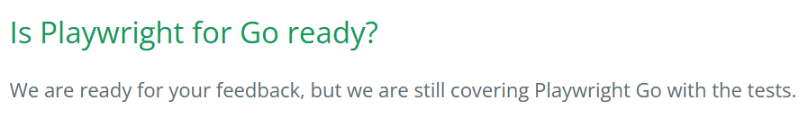

# Curiosity Report: Playwright

As a frontend developer, discovering Playwright was truly gamechanging.

## What is Playwright?

Playwright is a browser automation framework with a built-in test runner that allows for simple test writing, debugging, and execution. What makes it different from other testing frameworks is its cross-browser automation and the control it gives the developer over what and how the app is tested. And, Playwright has a variety of tools to streamline the process. This includes CLI commands, VS Code sidebar extensions, and usability with LLMs.

## Application

### Curiosity

After using Playwright for class, I began to think of how it could be used in my personal and professional life.

----

I want to make a portfolio site to show my past projects easier. This will require a lot of frontend development. With a lack of classes at BYU that teach the specifics and complexities of css and html, it's easy for me to make mistakes or forget to test different browsers/screen sizes. With Playwright, I can automate the testing to make sure the site has consistent rendering across different user interfaces.

My niche area of interest in web design is accessibility. I care about making apps usable to those who have special needs, since I believe everyone deserves to use the blessing of technology. I want to find out how I can use Playwright
to check for ADA compliance issues, as well as set custom accessibility standards.

At my job at BYU OIT, we use a lot of different languages. We are trying to scale down the amount of maintenance work by rewriting almost all our apps into *Go*. While I've been writing tests, I noticed how difficult it is to write tests for frontend apps; it's usually inconsistent, difficult to debug, and strict to the point where changing a color causes the test to fail (which usually isn't the part that needs to be tested). Not only does this make testing and writing new code frustrating, but it slows down progress. After learning about Playwright and using it in TypeScript, I wanted to see if it was possible to use it in Go.

### Research

#### Playwright for Go

Playwright is based on exposing a server in Node.js, so it can be used for languages that it supports  (JavaScript/TypeScript, Python, .Net, and Java). However, there is an (unofficial) open-source project in GitHub that is working on a wrapper that could allow for a Go-supported Playwright in the future. 



Tests can still be done in other languages while Go remains the primary language, but given that the goal is to shrink the number of languages we use using Playwright for Go applications is not practical for the time being. Meanwhile, I still plan to keep up to date with the community project and see if it can be used in the future.

#### Accessibility

Playwright can be used to test for accessibility issues. This includes checking:
- Color contrast
- Form labels
- Element Labels
- Duplicate IDs

It has options to scan the whole page:

```
const accessibilityScanResults = await new AxeBuilder({ page }).analyze();
```

Or to just check a specific part of the code:

```
const accessibilityScanResults = await new AxeBuilder({ page })
      .include('#navigation-menu-flyout')
      .analyze();
```

**Limitations**
- Testing other accessibility factors
  - Cannot fully test screen reader experience
  - Cannot verify logical meaning or usability
  - Cannot catch all WCAG issues automatically
- Can't define new accessibility standards beyond what axe supports
- Requires manual validation

**Features**
- Test different WCAG versions' success criteria
- Exclude specific elements from a scan
  - This can be helpful if there is an exception to the WCAG guidelines or an issue that cannot be resolved for whatever reason.
  ```
  const accessibilityScanResults = await new AxeBuilder({ page })
      .exclude('#element-with-known-issue')
      .analyze();
  ```
- Disable specific rules from a scan
  ```
  const accessibilityScanResults = await new AxeBuilder({ page })
      .disableRules(['duplicate-id'])
      .analyze();
  ```
- Combine Playwright snapshots with accessibility scans to detect regressions
- Export scan results

## Conclusion

I'm really impressed with what Playwright is able to do, especially since it answered the question I've had for years on how to effectively test user interfaces. Although I likely won't be able to use it for everything, I want to use it in any applications I work on that use Node.js. It changed my perspective on what it actually means to test the frontend, and will make me a better full stack developer.

## Resources
https://playwright.dev/

https://www.checklyhq.com/docs/learn/playwright/what-is-playwright/

https://playwright-community.github.io/playwright-go/


*AI used solely for fact-checking